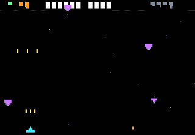
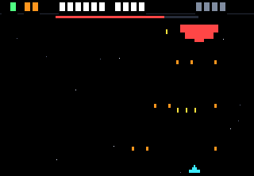
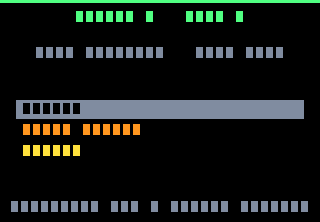
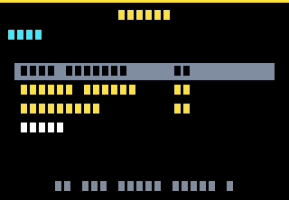

# NOVA

Un rogue-lite spatial pour calculatrice **NumWorks**. Écrit en Python, tient dans
les 32 Ko de mémoire de la machine, tourne à 25 images par seconde.


Tu pilotes un vaisseau à deux touches, tir automatique. Tu choisis ta route,
tu récupères des cristaux, tu améliores ton vaisseau chez le marchand, tu
affrontes un boss — cinq secteurs, puis **le Vide**, qui n'a pas de fin.

| | |
|---|---|
|  |  |
| **Combat** — tir auto, deux touches | **Boss** — il descend sur toi |
|  |  |
| **Choix de saut** — trois routes | **Marchand** — chaque ligne dit ce qu'elle fait |

*(Rendu de l'émulateur headless : les textes apparaissent en blocs parce que le
stub ne dessine pas les glyphes. Sur la calculatrice, ce sont de vraies lettres.)*

## Installation

Le jeu est en **5 scripts**. Ce n'est pas un caprice : MicroPython compile un
module d'un seul bloc et garde tout son arbre syntaxique en mémoire, donc c'est
le plus gros module qui fixe le pic — pas le total. Découpé, le jeu passe ; d'un
seul tenant, il déclenche `MemoryError` avant même de démarrer.

Sur <https://my.numworks.com/python>, crée ces cinq scripts et colle le contenu
du fichier correspondant dans `dist/` :

| Script à créer | Contenu à coller |
|---|---|
| `novad.py` | [`dist/novad.py`](dist/novad.py) |
| `novae.py` | [`dist/novae.py`](dist/novae.py) |
| `novaf.py` | [`dist/novaf.py`](dist/novaf.py) |
| `novag.py` | [`dist/novag.py`](dist/novag.py) |
| `nova.py` | [`dist/nova.py`](dist/nova.py) |

Puis envoie-les sur la calculatrice et lance **`nova`** (les quatre autres se
chargent tout seuls). Détails et dépannage : [docs/INSTALL.md](docs/INSTALL.md).

## Contrôles

| | Joueur 1 | Joueur 2 (coop) |
|---|---|---|
| Se déplacer | `←` `→` | `4` `6` |
| Tirer | automatique | automatique |
| Overdrive (bombe) | `EXE` (ou `OK` en solo) | `EXE` (partagé) |

Le tir est automatique et le vaisseau ne bouge qu'horizontalement : **deux
touches par joueur**. C'est une contrainte matérielle, pas une simplification —
le clavier NumWorks est une matrice 9×6 **sans diodes**, donc trois touches dont
deux partagent une ligne et deux une colonne font apparaître une quatrième
touche fantôme. Le mapping ci-dessus est le résultat : aucune combinaison
atteignable ne peut créer de fantôme, et
[`tests/test_controls.py`](tests/test_controls.py) le vérifie à chaque exécution.

`RETOUR` n'est jamais lue : Epsilon peut interrompre le script dessus.

## Le jeu

- **Trois routes par saut** : patrouille, patrouille d'élite, marchand ou
  atelier de réparation. Sept nœuds par secteur, puis le boss.
- **8 améliorations**, 3 niveaux chacune. Chaque ligne du marchand affiche ce
  qu'elle fait et son prix, qui augmente de moitié à chaque niveau.
- **5 types d'ennemis** aux comportements distincts, plus un boss par secteur
  dont les points de vie s'ajustent à ta puissance de feu réelle.
- **Coop 2 joueurs** sur la même calculatrice, coque et score partagés.
- **Le Vide** : après les cinq secteurs, ça continue sans limite, pour le score.

Mesuré sur des parties simulées : **7 minutes de combat pur** par partie, soit
douze à quinze minutes une fois comptés les menus. Le design complet et ce que
le matériel a imposé : [docs/GAME_DESIGN.md](docs/GAME_DESIGN.md).

## Performances

La NumWorks donne à Python **32 Ko de tas**, avec une API graphique sans sprite,
sans blit et sans double tampon. NOVA n'efface jamais l'écran : chaque objet
mobile s'efface à son ancienne position et se redessine à la nouvelle.

Mesuré par [`tests/test_combat.py`](tests/test_combat.py) sur de vraies parties :

| Scénario | Appels/frame (moy.) | Pic | Pixels repeints/frame |
|---|---:|---:|---:|
| Secteur 1, première patrouille | 42 | 52 | 902 |
| Secteur 3, en profondeur | 48 | 65 | 1 072 |
| Secteur 5, élite | 54 | 79 | 1 734 |
| Secteur 5, coop 2 joueurs | 59 | 82 | 1 835 |
| Secteur 5, armement maximal | 69 | **92** | 1 740 |

Budget : à 25 fps une image dure 40 ms, et Epsilon encaisse environ 6 000 appels
`kandinsky` par seconde, soit **~240 appels** par image. Le pire cas mesuré en
utilise 92 — il reste 2,6× de marge. Côté pixels, une image repeint **1,3 % à
2,6 %** de l'écran au lieu des 71 040 pixels qu'un effacement complet coûterait.

**Mémoire** : `tools/memcheck.py` fait tourner le vrai interpréteur MicroPython
1.17 — la version qu'embarque Epsilon — et cherche par dichotomie le plus petit
tas capable de charger le jeu. Résultat actuel : **47 Ko** sur un build 64 bits,
dont les pointeurs sont deux fois plus larges que ceux de la calculatrice.

Les techniques employées et pourquoi elles comptent :
[docs/OPTIMIZATION.md](docs/OPTIMIZATION.md).

## Développement

```bash
python3 tools/build.py       # src/ -> dist/ (-54 %)
python3 tests/run_all.py     # suite complète, sur la source ET le build livré
python3 tests/test_balance.py  # simule des parties, mesure l'équilibrage
tools/mp/build.sh            # compile MicroPython 1.17 (une fois)
python3 tools/memcheck.py    # mesure le tas réellement nécessaire
python3 tools/screenshot.py  # régénère docs/img/
```

`src/` est la source lisible et commentée. `dist/` est ce qu'on colle dans la
calculatrice — généré, jamais édité à la main.

Le projet embarque un **émulateur headless** (`tools/emu/`) qui réimplémente
`kandinsky` et `ion` sans écran ni SDL, en comptant les appels de dessin. C'est
lui qui permet de faire tourner de vraies parties en intégration continue et de
prouver que le build minifié fonctionne : `tests/run_all.py` exécute la suite
entière **deux fois**, sur la source puis sur `dist/`.

| Test | Ce qu'il empêche |
|---|---|
| `test_controls` | Un mapping clavier qui produit des touches fantômes |
| `test_termination` | Un combat qui ne finit jamais — sur calculatrice, il n'y a pas d'échappatoire |
| `test_endless` | Un plantage d'index au secteur 30 du Vide |
| `test_combat` | Une image qui dépasse le budget de dessin |
| `test_balance` | Une courbe de difficulté plate ou injouable |
| `tools/memcheck.py` | Le `MemoryError` au lancement |

## Licence

MIT — voir [LICENSE](LICENSE).
