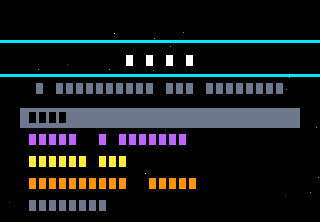
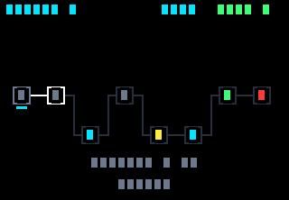
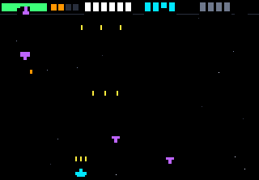
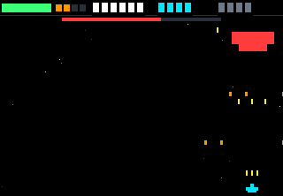
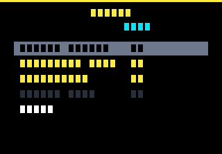

# NOVA

Un rogue-lite spatial pour calculatrice **NumWorks**. Écrit en Python, tient dans
la moitié du stockage de la machine, tourne à 25 images par seconde.



Tu pilotes un vaisseau à deux touches, tir automatique. Tu traverses une carte de
secteur à embranchements, tu récupères des cristaux, tu améliores ton vaisseau
chez le marchand, tu affrontes un boss, et tu recommences — cinq secteurs, puis
le **Vide**, qui n'a pas de fin.

| | |
|---|---|
|  |  |
| **Carte de secteur** — tu choisis ta route | **Combat** — tir auto, deux touches |
|  |  |
| **Boss** — il descend sur toi | **Marchand** — 12 améliorations, 3 niveaux chacune |

*(Rendu de l'émulateur headless : les textes apparaissent en blocs parce que le
stub ne dessine pas les glyphes. Sur la calculatrice, ce sont de vraies lettres.)*

## Installation

```
1. Ouvre https://my.numworks.com/python et connecte-toi
2. Crée un script nommé  nova.py
3. Colle le contenu de  dist/nova.py
4. Branche la calculatrice en USB, clique sur « Envoyer le script »
5. Sur la calculatrice : Python → nova → EXE
```

Détails et dépannage : [docs/INSTALL.md](docs/INSTALL.md).

## Contrôles

| | Joueur 1 | Joueur 2 (coop) |
|---|---|---|
| Se déplacer | `←` `→` | `4` `6` |
| Tirer | automatique | automatique |
| Overdrive | `EXE` (ou `OK` en solo) | `EXE` (partagé) |
| Pause | `RETOUR ARRIÈRE` | |

Le tir est automatique et le vaisseau ne se déplace qu'horizontalement : **deux
touches par joueur**. Ce n'est pas de la simplification, c'est une contrainte
matérielle — le clavier NumWorks est une matrice 9×6 **sans diodes**, donc trois
touches dont deux partagent une ligne et deux une colonne font apparaître une
quatrième touche fantôme. Le mapping ci-dessus est le résultat : aucune
combinaison atteignable ne peut créer de fantôme, et
[`tests/test_controls.py`](tests/test_controls.py) le vérifie à chaque exécution.

## Le jeu

- **Carte de secteur** à embranchements : combats, élites, événements, marchand,
  atelier de réparation, boss. Chaque route passe par un marchand (colonne 4) et
  un atelier (colonne 6) — quel que soit le chemin, le rythme est le même.
- **12 améliorations**, 3 niveaux chacune : cadence, dégâts, canons multiples,
  munitions perforantes, déflecteur, rayon tracteur, coque, overdrive…
- **5 types d'ennemis** aux comportements distincts, plus un boss par secteur.
- **3 difficultés** — Cadet, Pilote, As.
- **Coop 2 joueurs** sur la même calculatrice, coque et score partagés.
- **Graines** : entre le même code et tu affrontes exactement les mêmes vagues.
  De quoi se défier à distance sur une machine sans radio.
- **Le Vide** : après les cinq secteurs, ça continue sans limite, pour le score.

Le design complet, y compris ce que le matériel a imposé :
[docs/GAME_DESIGN.md](docs/GAME_DESIGN.md).

## Performances

La NumWorks donne à Python **32 Ko de tas** et **32 Ko de stockage pour tous les
scripts**, avec une API graphique sans sprite, sans blit et sans double tampon.
NOVA n'efface jamais l'écran : chaque objet mobile s'efface à son ancienne
position et se redessine à la nouvelle.

Mesuré par [`tests/test_combat.py`](tests/test_combat.py) sur de vraies parties :

| Scénario | Appels/frame (moy.) | Pic | Pixels repeints/frame |
|---|---:|---:|---:|
| Secteur 1, première patrouille | 33 | 52 | 923 |
| Secteur 3, en profondeur | 41 | 74 | 1 318 |
| Secteur 5, élite | 53 | 83 | 2 230 |
| Secteur 5, coop 2 joueurs | 58 | 92 | 2 354 |
| Secteur 5, armement maximal | 62 | **101** | 1 923 |

Budget : à 25 fps une image dure 40 ms, et Epsilon encaisse environ 6 000 appels
`kandinsky` par seconde, soit **~240 appels** par image. Le pire cas mesuré en
utilise 101 — il reste plus du double de marge. Côté pixels, une image repeint
entre **1,3 % et 4,7 %** de l'écran au lieu des 71 040 pixels qu'un effacement
complet coûterait.

Taille du build : **17 444 octets**, soit 53 % du stockage disponible.

Les dix techniques employées et pourquoi elles comptent sur MicroPython :
[docs/OPTIMIZATION.md](docs/OPTIMIZATION.md).

## Développement

```bash
python3 tools/build.py       # src/nova.py -> dist/nova.py (-62 %)
python3 tests/run_all.py     # suite complète, sur la source ET sur le build livré
python3 tools/lint_globals.py src/nova.py
python3 tools/screenshot.py  # régénère docs/img/
```

`src/nova.py` est la source lisible et commentée. `dist/nova.py` est ce qu'on
colle dans la calculatrice — généré, jamais édité à la main.

Le projet embarque un **émulateur headless** (`tools/emu/`) qui réimplémente
`kandinsky` et `ion` sans écran ni SDL, en comptant les appels de dessin. C'est
lui qui permet de faire tourner de vraies parties en intégration continue, de
mesurer le coût d'une image, et de prouver que le build minifié fonctionne :
`tests/run_all.py` exécute la suite entière **deux fois**, sur la source puis sur
`dist/nova.py`.

Ce que la suite garantit :

| Test | Ce qu'il empêche |
|---|---|
| `test_controls` | Un mapping clavier qui produit des touches fantômes |
| `test_map` | Un nœud inatteignable, une route sans marchand, un cul-de-sac |
| `test_termination` | Un combat qui ne se termine jamais — sur calculatrice, il n'y a pas d'échappatoire |
| `test_endless` | Un plantage d'index au secteur 30 du Vide |
| `test_combat` | Une image qui dépasse le budget de dessin |
| `test_balance` | Une courbe de difficulté plate ou injouable |

## Licence

MIT — voir [LICENSE](LICENSE).
