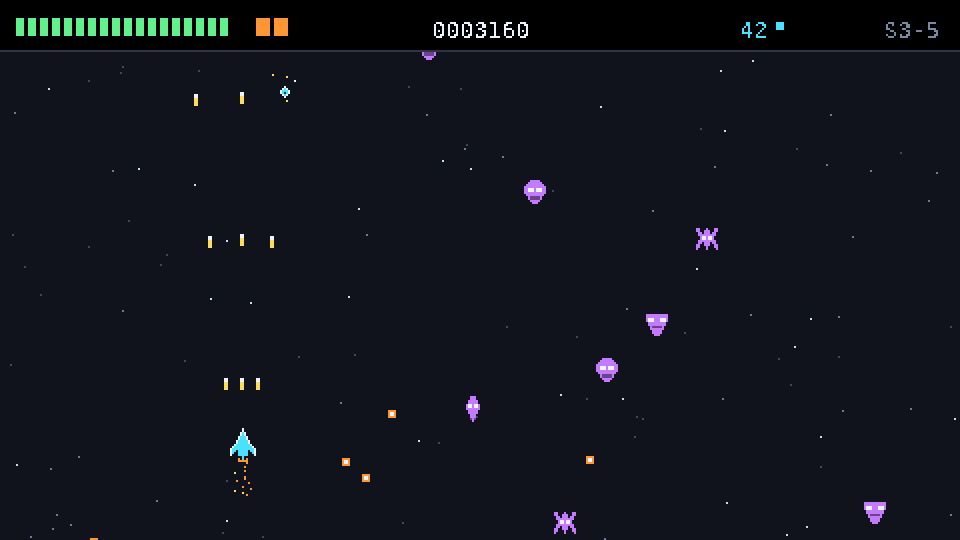
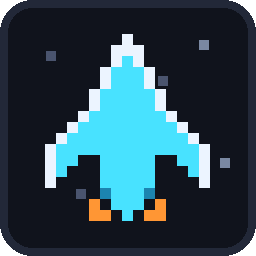
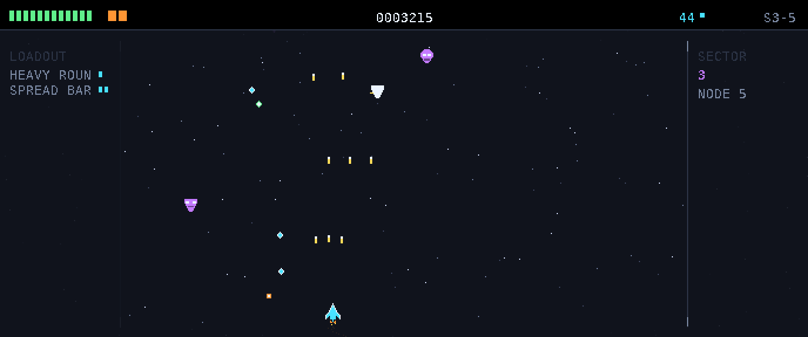
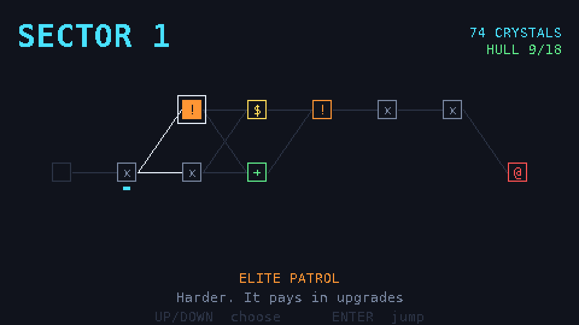
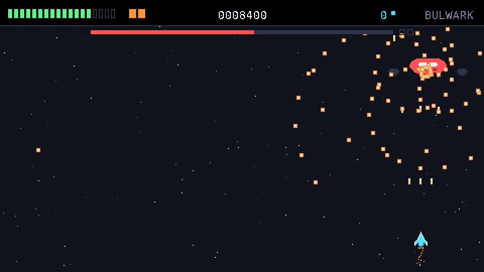
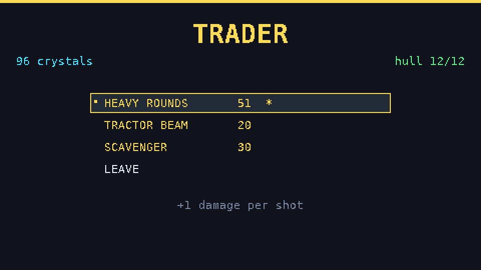
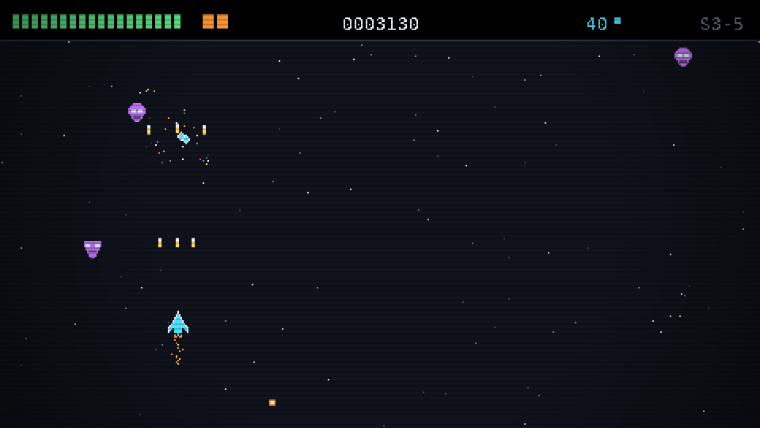
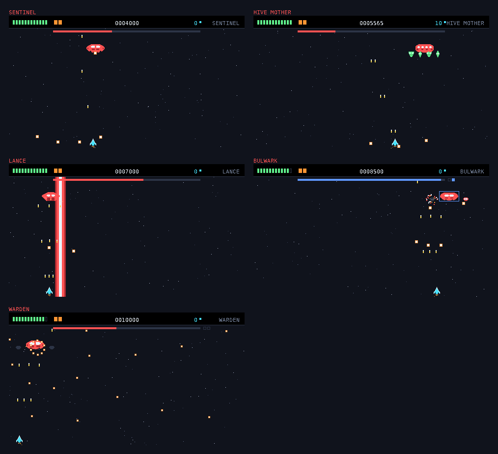

# NOVA — édition PC

La version pygame de [NOVA](../README.md). Même jeu, mêmes règles, mais sans les
32 Ko de RAM qui ont forcé la version calculatrice à tout élaguer.



## Lancer

**Le plus simple** — installe tout et démarre, en une commande :

| | |
|---|---|
| Windows | double-clic sur **`play.cmd`** |
| Linux / macOS | **`./play.sh`** |

Le script trouve Python, crée un environnement isolé dans `pc/.venv`, installe
les dépendances et lance le jeu. Les fois suivantes, il démarre directement.

Il installe **pygame-ce** en priorité — le fork communautaire publie des paquets
pour les nouvelles versions de Python des mois avant pygame classique, ce qui
évite l'erreur de compilation habituelle sur un Python tout frais. Même
`import pygame`, et si pygame-ce n'est pas disponible il retombe sur pygame.

**À la main**, si tu préfères :

```bash
pip install pygame-ce numpy   # ou: pip install pygame numpy
python3 nova.py
```

## Créer un exécutable

| | |
|---|---|
| Windows | **`build_exe.cmd`** → `dist\NOVA.exe` |
| Linux / macOS | **`./build_exe.sh`** → `dist/NOVA` |

Un seul fichier, icône incluse, aucune installation de Python requise pour y
jouer. Il n'y a pas de compilation croisée : un `.exe` Windows doit être
construit sur Windows.



| Option | |
|---|---|
| `--scale N` | Force un zoom entier (par défaut : choisi selon l'écran) |
| `--fullscreen` | Démarre en plein écran |
| `--no-crt` | Coupe les scanlines |
| `--no-sound` | Démarre en muet |

En jeu : `F11` plein écran · `F1` filtre CRT · `M` muet · `+`/`-` taille · la
fenêtre est redimensionnable à la souris.

## Résolutions

Le jeu s'adapte à n'importe quelle résolution, **sans bandes noires**. Le zoom
est toujours un **entier** — un pixel de jeu reste un carré net — et le canvas
prend ensuite autant de pixels de jeu qu'il en faut pour remplir l'écran.

| Écran | Zoom | Canvas | Arène |
|---|---|---|---|
| 1920×1080 | ×4 | 480×270 | 480×244 |
| 2560×1440 | ×5 | 512×288 | 480×244 |
| **3440×1440** (21:9) | ×5 | 688×288 | 480×244 |
| 1920×1200 (16:10) | ×4 | 480×300 | 480×244 |
| 1366×768 | ×3 | 455×256 | 455×230 |
| 3840×2160 | ×8 | 480×270 | 480×244 |

**L'arène, elle, ne change pas.** Sur un shmup vertical, la largeur du terrain
*est* un réglage de difficulté : donner 40 % de place en plus à quelqu'un en
ultrawide, c'est lui donner un autre jeu, plus facile. L'arène garde donc une
taille fixe, centrée, et le canvas supplémentaire devient du décor — champ
d'étoiles, rails, et un panneau latéral qui affiche l'équipement du vaisseau.



*3440×1440. L'arène est cadrée par ses rails, les marges portent le loadout à
gauche et le secteur à droite.*

Sur un écran étroit (1366×768), l'arène se réduit pour tenir, et il n'y a
simplement pas de marges.

## Son

Tout est **synthétisé au démarrage** — ondes carrées, triangles et bruit avec
enveloppes, comme une NES. Aucun fichier audio dans le dépôt : 20 effets et
cinq boucles de musique, construits en **0,04 seconde**.

À écouter : [`docs/nova-sound-demo.wav`](../docs/nova-sound-demo.wav) — les
20 effets puis un extrait de musique.

| | |
|---|---|
| Armes | tir simple, tir large (3+ canons), tir ennemi |
| Impacts | touche, explosion, explosion de boss |
| Vaisseau | dégât, déflecteur qui encaisse, déflecteur rechargé, bombe |
| Butin | cristal, réparation |
| Interface | navigation, validation, refus, achat, saut |
| Jingles | alerte boss, secteur terminé, fin de partie |

La musique change à chaque secteur : basse triangle et arpège carré, gamme et
tempo propres à chacun, structure tirée de la graine de la partie.

`M` coupe le son. Sans numpy, ou sur une machine sans carte son, le jeu
démarre en silence plutôt que de planter.

## Contrôles

| | Joueur 1 | Joueur 2 (coop) |
|---|---|---|
| Se déplacer | flèches **ou** WASD | WASD |
| Tirer | automatique | automatique |
| Bombe | `Espace` ou `Maj` | partagée |
| Menus | flèches + `Entrée` | |

### Manette

Branchée avant ou pendant la partie, ça marche : stick gauche ou croix
directionnelle pour se déplacer, bouton du bas ou gâchette pour la bombe, et la
navigation des menus suit. Les manettes sont attribuées dans l'ordre de
branchement — la première au joueur 1, la seconde au joueur 2.

**Clavier et manette restent actifs en même temps.** En coop, l'un peut tenir
une manette pendant que l'autre joue au clavier, ce qui est la façon dont ces
choses se jouent vraiment sur un canapé.

Contrairement à la calculatrice — dont le clavier matriciel sans diodes
interdisait plus de deux touches — le vaisseau se déplace ici en **8 directions**.
Le tir reste automatique : c'est l'identité du jeu, et ça laisse les deux mains
pour esquiver.

## Ce que la version PC récupère

Tout ce que les 32 Ko avaient coûté :

| | Calculatrice | PC |
|---|---|---|
| Carte de secteur | un menu à 3 routes | **le graphe complet, avec diagonales** |
| Améliorations | 8 | **12** |
| Difficultés | une seule | **3** (Cadet / Pilote / As) |
| Événements | ✗ | **6**, avec choix et conséquences |
| Ramassage de cristaux | crédité à la mort | **butin à ramasser**, aimantable |
| Explosions | ✗ | particules, débris, screen shake |
| Boss | un pattern | **5 boss différents**, un par secteur |
| Étoiles | 2 couches, 12 étoiles | 3 couches, 140 étoiles |

Plus, en propre à cette version : sprites pixel art dessinés (au lieu de trois
rectangles par vaisseau), traînées de réacteur, flash blanc à l'impact,
hit-stop sur les dégâts, filtre CRT optionnel.

| | |
|---|---|
|  |  |
| La carte de secteur, enfin dessinée | Boss en phase 2 |
|  |  |
| Le marchand dit ce qu'il vend | Le filtre CRT, `F1` |

## Les boss

Le premier jet PC avait un seul boss reskinné par secteur : le combat censé
être la conclusion d'un secteur était le même combat à chaque fois. Chacun a
maintenant sa propre mécanique.



| | |
|---|---|
| **SENTINEL** | Plateforme d'artillerie. Éventails de tirs, puis salves circulaires. Lis les trous. |
| **HIVE MOTHER** | Porte-vaisseaux. Ouvre ses baies et lâche des escortes. Le canon est accessoire. |
| **LANCE** | Un canon géant. Charge, **télégraphe**, puis tire un rayon vertical. Toujours esquivable. |
| **BULWARK** | Un cœur derrière deux **modules destructibles**. Tant qu'un module tient, le cœur ne prend qu'un quart des dégâts — la barre de vie passe au bleu pour le dire. |
| **WARDEN** | Tout à la fois, en trois phases : modules, puis rayon, puis escortes. |

Ils partagent un corps — dérive, points de vie, phases selon la coque restante.
Ce qui change est une seule méthode, `act`, dispatchée une fois par image : le
seul endroit où vit la personnalité d'un boss.

Chaque combat s'ouvre sur une carte qui nomme le boss et dit ce qu'il fait : un
combat qu'on n'a jamais vu ne devrait pas commencer par une surprise qu'on ne
pouvait pas lire. Et leur cadence de tir dépend du secteur — le premier boss se
rencontre souvent avec un vaisseau d'origine, et un motif juste à la vitesse du
secteur 5 n'est pas un motif juste au secteur 1.

## Structure

```
pc/
  nova.py            point d'entrée
  nova/
    data.py          palette, sprites (en texte), tables, événements
    art.py           construit les surfaces, teinte les ennemis par secteur
    entities.py      vaisseaux, tirs, butin — tout en pixels par seconde
    combat.py        la scène de combat
    fx.py            particules, shake, flash, étoiles, overlay CRT
    audio.py         synthèse chiptune : ondes, enveloppes, catalogue, musique
    boss.py          les cinq boss, leurs rayons et leurs modules
    gamepad.py       manettes : sticks, croix, boutons, branchement à chaud
    sector.py        génération et rendu de la carte
    run.py           l'état d'une partie
    ui.py            menus, panneaux, HUD
    game.py          machine à états et boucle principale
  assets/nova.ico    icône de l'exécutable (générée)
  play.sh play.cmd   installe et lance
  build_exe.sh/.cmd  construit l'exécutable
  nova.spec          recette PyInstaller
  tests/             suite headless
  tools/shots.py     rend les captures d'écran
  tools/make_icon.py dessine l'icône
```

## Tests

Tout tourne sans écran (`SDL_VIDEODRIVER=dummy`), donc en intégration continue :

```bash
python3 tests/run_all.py     # runs complets + budget d'image
python3 tools/shots.py       # régénère les captures
```

`test_run.py` joue de vraies parties à travers la vraie machine à états — mêmes
événements clavier, mêmes combats, rien n'est simulé sauf l'écran. Il valide
aussi qu'aucun écran ne peut mener à une impasse.

`test_gamepad.py` pilote la vraie logique de manette avec un faux périphérique :
axes, croix, boutons, transitions de menu, débranchement. Aucune manette ne peut
être branchée en CI, et un mapping testé uniquement à la main est un mapping qui
casse en silence — celui-ci a d'ailleurs trouvé un vrai conflit, le bouton Est
étant à la fois « valider » et « annuler ».

`test_audio.py` attrape un piège discret : un nom d'effet mal orthographié est
**silencieux, pas une erreur** — `play("expode")` ne fait rien, pour toujours,
et personne ne le remarque. Le test enregistre chaque son demandé pendant une
partie et exige que les deux ensembles coïncident dans les deux sens ; un effet
construit mais jamais déclenché est aussi une anomalie. Les sons rares
(réparation, déflecteur, refus d'achat, fin de partie) sont provoqués
explicitement, sinon le résultat dépendrait de la graine.

Mesures actuelles :

| | |
|---|---|
| Taux de victoire (bot) | Cadet 7/8 · **Pilote 4/8** · As 1/8 |
| Durée d'une partie gagnée | 9 à 11 min de combat |
| Coût d'une image (p99) | **1,35 ms** sur un budget de 16,7 ms |
| Construction des sons | 20 effets en **0,04 s** au démarrage |

Le pilote automatique a une information parfaite et des réflexes parfaits mais
une stratégie naïve : un humain fera moins bien, ce qui est le bon sens de
l'erreur pour un contrôle de difficulté.

## Licence

MIT, comme le reste du dépôt.
